<p align="center">
    
</p>

<h1 align="center">GodoOS</h1>
一款高效的内网办公平台，内含word/excel/ppt/pdf/内网聊天/白板/思维导图等多个办公系统工具，支持原生文件存储。平台界面精仿windows风格，操作简便，同时保持低资源消耗和高性能运行。无需注册即可自动连接内网用户，实现即时通讯和文件共享。

<div align="center">

[![license][license-image]][license-url] 

[English](README.md) | 简体中文

### 安装

[![Windows][Windows-image]][Windows-url]
[![MacOS][MacOS-image]][MacOS-url]
[![Linux][Linux-image]][Linux-url]

[官方文档](./docs/Api.md) | [使用说明](./docs/Guide.md)

[license-image]: ./docs/img/license_%20MIT.svg

[license-url]: https://spdx.org/licenses/MIT.html


[Windows-image]: ./docs/img/Windows.svg

[Windows-url]: https://gitee.com/ruitao_admin/godoos/releases/download/v1.0.0/godoos-windows.exe

[MacOS-image]: ./docs/img/MacOS.svg

[MacOS-url]: https://gitee.com/ruitao_admin/godoos/releases/download/v1.0.0/godoos-macos.dmg

[Linux-image]: ./docs/img/Linux.svg

[Linux-url]: https://gitee.com/ruitao_admin/godoos/releases/download/v1.0.0/godoos-linux

</div>

## 亮点
- 无需联网使用，全开源
- 零配置，无需注册，下载即用
- 零污染，无插件依赖
- 精小，打包后仅61M，确包含了所有的办公套件
- 可无限扩展，支持自定义应用
- golang开发后端，低资源消耗和高性能

## 功能说明

### 一、系统桌面
- 精仿windows风格
- 桌面文件管理
- 支持原生文件拖拽上传
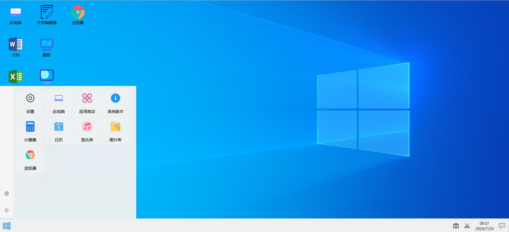

### 二、文件管理
- 文件拖拽上传
- 文件搜索
- 原生文件存储
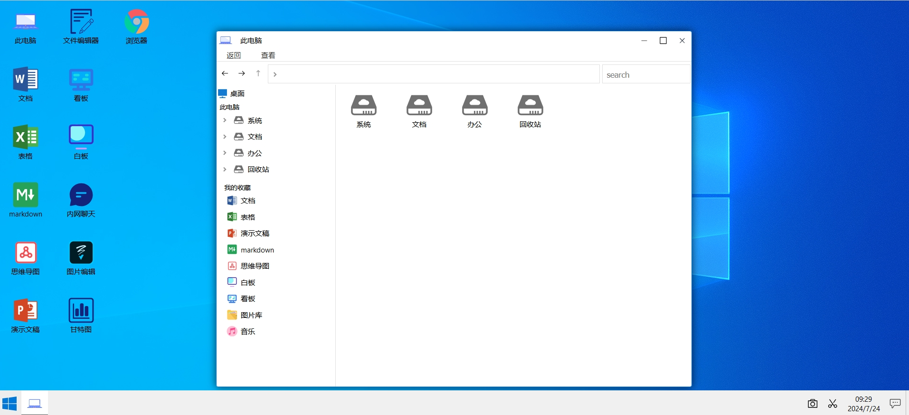

### 三、内网聊天
- 无需繁琐的注册流程，只需在同一局域网内，即可自动发现并列出所有可用的聊天对象，即刻开启即时通讯。支持基于局域网的即时消息传输、文件传输等功能，促进团队内部的无缝沟通与协作。
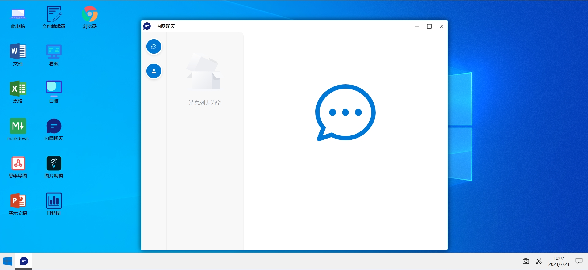

### 四、文档
- 简便的word编辑器，原生存储，支持二维码、手写签名，导入导出
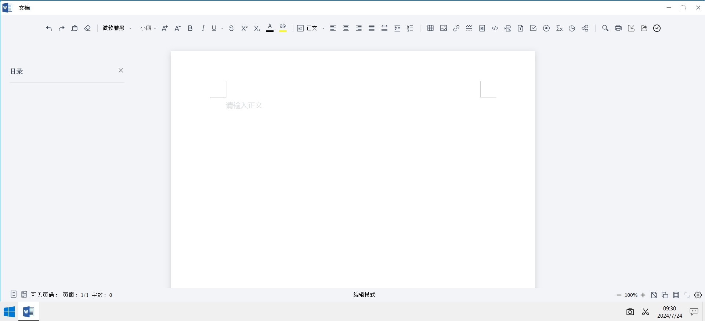

### 五、表格
- 原生存储，Excel编辑器，支持导入、导出，支持图片、公式
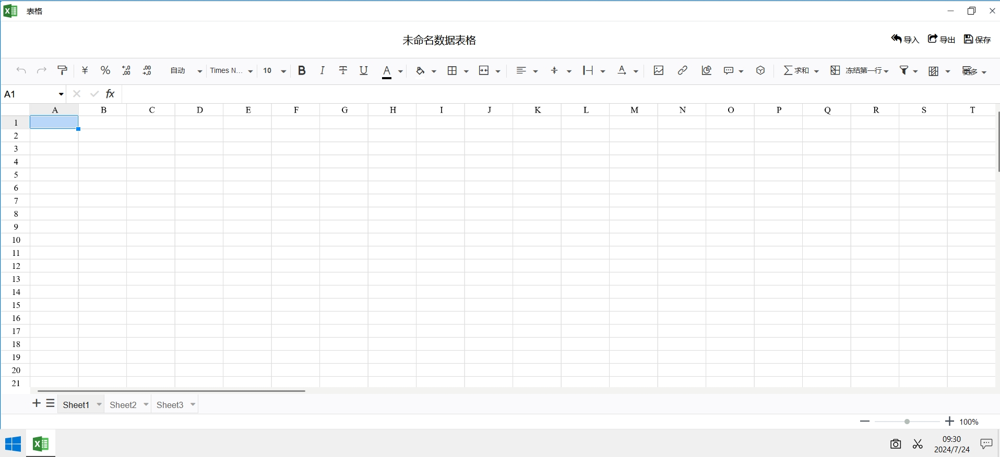

### 六、markdown
- 原生存储，采用vditor，支持导入、导出，支持大纲、实时预览
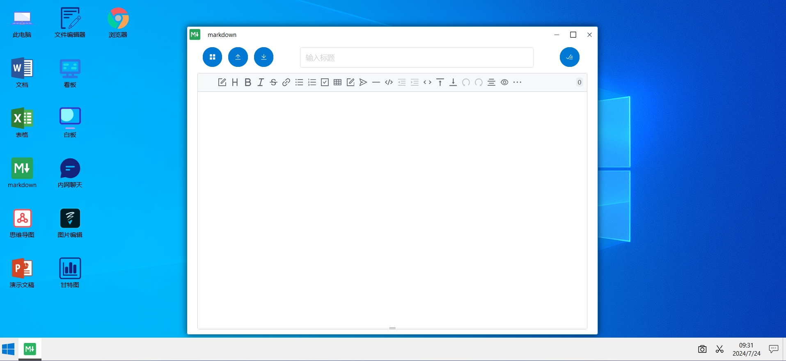

### 七、思维导图
- 内置多种主题；支持快捷键；节点内容支持图片、图标、超链接、备注、标签。
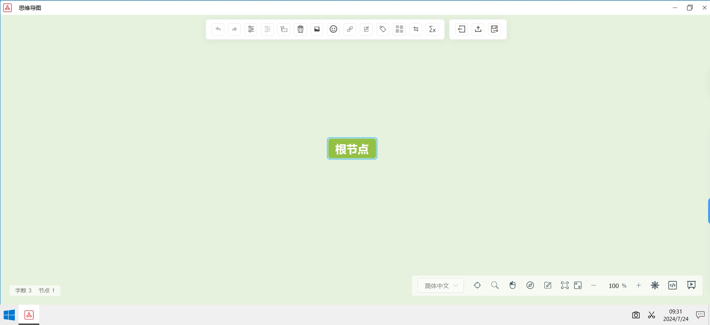

### 八、演示文稿
- 原生存储，采用pptist，支持文字、图片、形状、线条、图表、表格、视频、公式等。
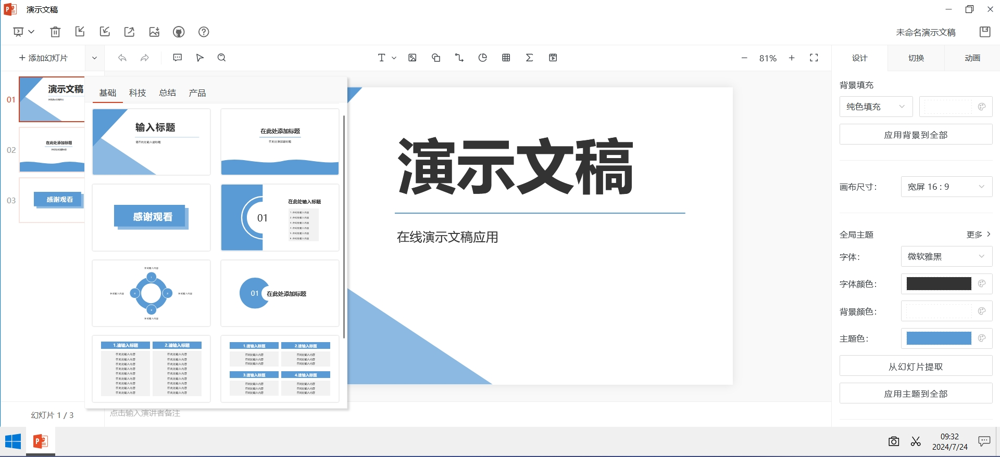

### 九、文件编辑器
- 原生存储，支持打开text/html/css/js/svg/xml/md等，可以当作一个简单的在线editplus。
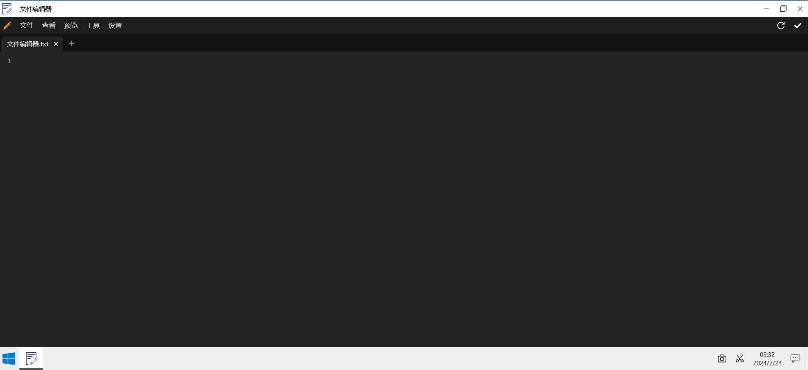

### 十、白板
- 集自由布局、画笔、便签多种创意表达能力于一体，激发团队创造力，随时随地，围绕一块白板沟通。 
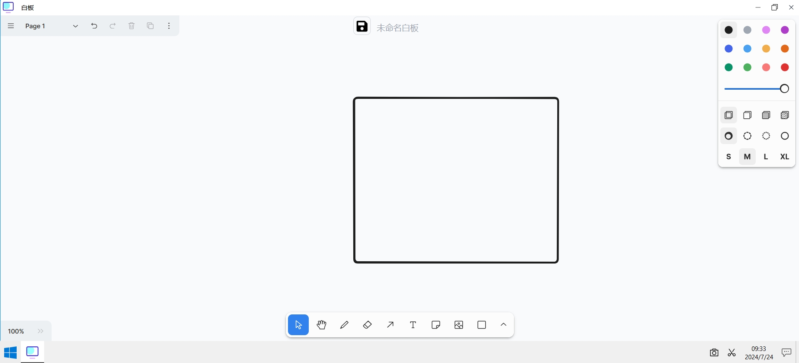

### 十一、图片编辑
- 一个小型的photoshop，原生存储，支持搜索图片，支持图片裁剪、旋转、缩放、滤镜等功能
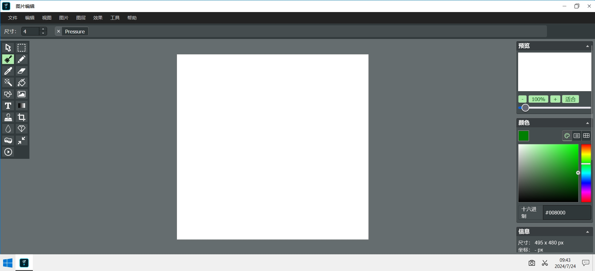

### 十二、甘特图
- 项目管理必备工具，支持自定义项目人员和角色，支持拖拽/管理分配（资源、角色、工作）等。
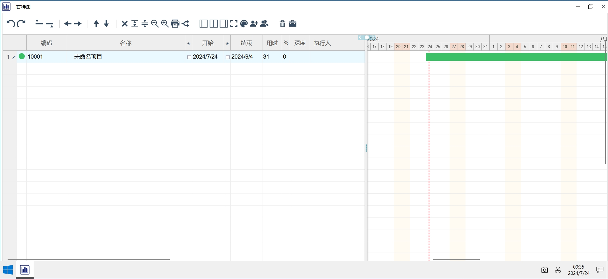

### 十三、浏览器
- 一款简单的内置浏览器
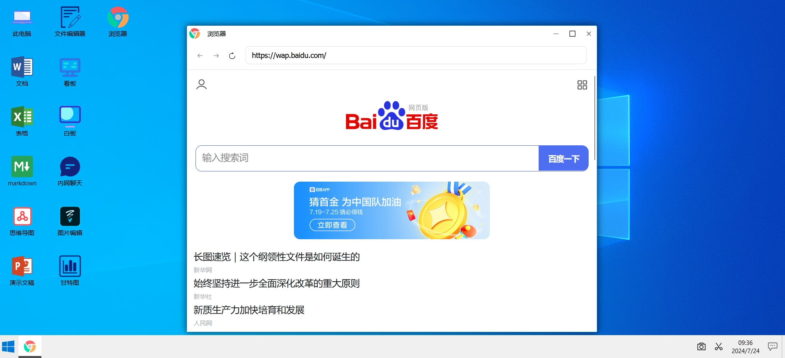


### 十四、系统设置
- 可在这里切换存储方式，可切换系统背景。
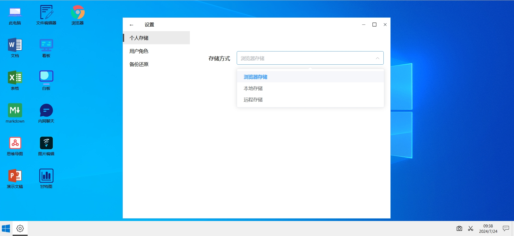

### 十五、应用商店
- 应用商店管理，可添加外部应用。

### 十六、截图
- 一个简单的截图工具。截图后文件存到本地。

### 十七、录屏
- 一个简单的录屏工具。录屏后录后文件存到本地。

### 十八、计算器
- 一个仿windows10的计算器，支持历史记录。
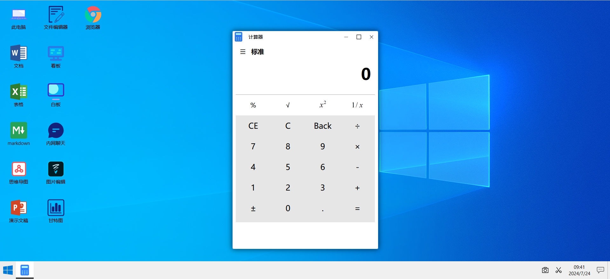

### 十九、音乐库
- 一个简单的声音存储库，支持播放音乐。

### 二十、图片库
- 一个简单的图片存储库，支持查看图片

### 二十一、看板
- 支持标准看板，项目管理必备工具，可快速创建看板并放置到不同的文件夹
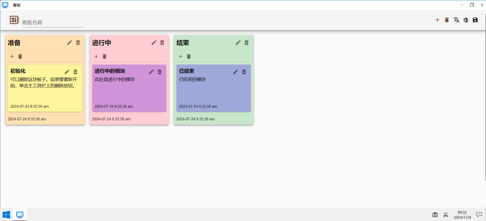

## 开发
### 构建
- 前端构建
```bash
cd frontend
pnpm i
pnpm build
```
- 后端构建
```bash
# go install github.com/wailsapp/wails/v2/cmd/wails@latest
wails build
# wails build -nsis -upx //you need install nsis and upx
```
## 感谢
- [element-plus](http://element-plus.org/)
- [vue3](https://v3.cn.vuejs.org/)
- [wails](https://wails.io/)
- [pptist](https://github.com/pipipi-pikachu/PPTist)
- [vditor](https://github.com/Vanessa219/vditor)
- [mind-map](https://github.com/wanglin2/mind-map)
- [canvas-editor](https://github.com/Hufe921/canvas-editor)